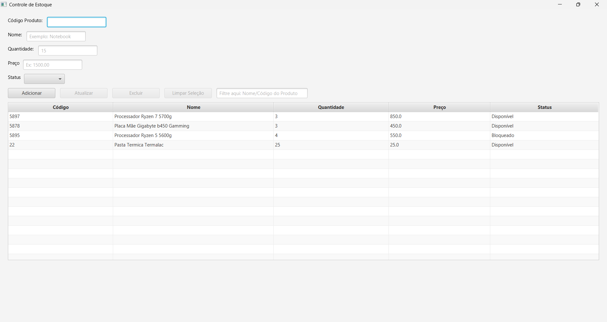

# Aplicação de Controle de Estoque 📦

#### Autor: [Gabriel Perin](https://github.com/Gabriel-Perin99)

Aplicação simples de controle de estoques diversos, gerenciados pela tecnologia **Spring**, que atende requisições HTTP no formato **JSON**, além de um banco de dados gerado automaticamente em **SQLite**, com tratamento das dependências e plugins feito pelo **Maven**.

Esta aplicação também apresenta uma GUI integrada para facilitar a experiência do usuário, possuindo as **principais operações** para um controle de estoque:

- Adicionar produtos
- Fazer atualizações de informações
- Excluir produtos
- Tabela visual diretamente do banco de dados
- Busca de itens em tempo real



***

## Tecnologias Usadas ⚙️

- [Spring](https://spring.io/)
- [Apache Maven](https://www.apache.org/)
- [Java](https://www.oracle.com/br/java/)
- [JavaFX](https://openjfx.io/)
- [SQLite JDBC](https://github.com/xerial/sqlite-jdbc)

***

## Como Usar 🚀

- **Clone este repositório:**
```bash
  git clone https://github.com/Gabriel-Perin99/Spring-Stock-Controller.git
```

 - Caso deseje executar somente a Aplicação, **sem a Interface**, basta rodar a classe **SpringStockControllerApplication.java**, que é responsável pela **aplicação Spring**:
```
 src/main/java/com/gitHub/GabrielPerin/Spring_Stock_Controller/SpringStockControllerApplication.java
```

 - Caso queira executar juntamente com a Interface, basta rodar a classe **Main.java**, que primeiramente irá executar a **aplicação Spring** e depois abrirá a **Interface**:
```
src/main/java/com/gitHub/GabrielPerin/Spring_Stock_Controller/Main.java
```
***
## Observações 💬

- A configuração inicial desta aplicação **cria** um banco de dados local na máquina com o nome de **meu_banco_de_dados.db**.<br>
- Em caso de **alteração do nome do DB** ou a **implementação de outro banco**, será necessário fazer uma nova configuração conforme a necessidade para sua utilização.